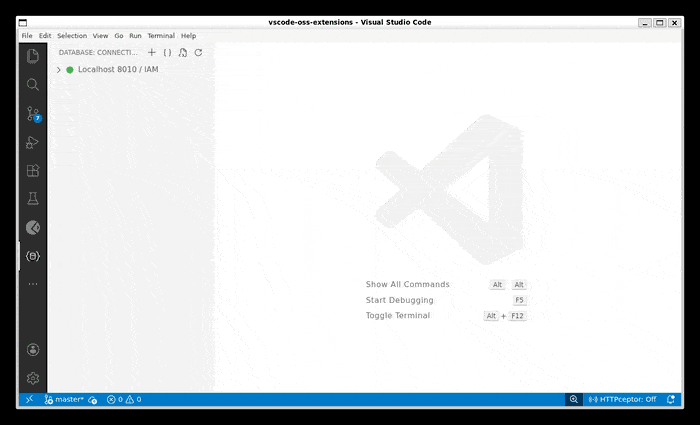

  

# SQLxs — Database Tools for VS Code

> Brings the database tooling experience of JetBrains IDEs (IntelliJ IDEA, DataGrip, WebStorm, PhpStorm, PyCharm, GoLand, Rider) to Visual Studio Code.

If you've ever used the **Database tool window** in any JetBrains IDE, you know how productive it is to browse tables, run queries, edit data, and inspect schemas — all without leaving your editor. SQLxs brings that same workflow to VS Code, VSCodium, Cursor, Windsurf, and other VS Code-based editors.

---

## Why SQLxs?

JetBrains IDEs ship with excellent built-in database support, but if your editor is VS Code, you're left with fragmented or cloud-dependent alternatives. SQLxs fills that gap:

- **Universal Compatibility** — Fully compatible with **VSCodium** and other VS Code-based IDEs like **Cursor**, **Windsurf**, and **Antigravity**. Published to the **[Open VSX Registry](https://open-vsx.org/extension/abridge/sqlxs)** for the broadest accessibility
- **Familiar UX** — Modeled after DataGrip / IntelliJ's Database tool window: connection tree, data grid with sort & filter, transpose view, DDL viewer, inline cell editing
- **SQL Console with CodeLens** — Write `.sql` files with multiple query blocks, each with a `▶ Run` button — like httpYac for databases. Column autocomplete included
- **100% Local** — No accounts, no cloud sync, no telemetry. Connections and consoles stay on your machine
- **Import/Export** — Paste IntelliJ XML data sources or JSON configs to import connections instantly. Export back to share with teammates who use JetBrains
- **Lightweight** — No bundled database drivers to download. Ships with `mysql2` and `pg` — connect and go

---

## Supported Databases

| Database    | Status |
| ----------- | ------ |
| MySQL       | ✅      |
| PostgreSQL  | ✅      |
| TimescaleDB | ✅      |

---

## Key Features

### Connection Management
- Add, edit, delete connections with a dense form (SSL/TLS support)
- Import from **IntelliJ XML** (paste from DataGrip/IntelliJ/WebStorm/PhpStorm/PyCharm) or **JSON**
- Export connections as JSON or IntelliJ-compatible XML for sharing
- Color-coded connection icons in the tree
- Database selector — choose which databases to show per connection

### Database Explorer
- Collapsible tree: Connections → Databases → Tables
- Case-insensitive sorting
- SQL Consoles folder per connection — persistent `.sql` files, rename, delete

### Data Grid (Table Viewer)
- Server-side **ORDER BY** with multi-column sort (Shift/Ctrl+Click)
- Server-side **WHERE filter bar** with column-name autocomplete
- **Pagination** — first/last/prev/next page, configurable page size, total row count
- **Transpose view** — JetBrains-style axis swap (fields as rows, records as columns)
- **Inline cell editing** — F2 or double-click, dirty tracking with yellow markers, transactional commit/rollback
- **Add / Clone / Delete rows** — `+ Add Row` toolbar button for blank inserts, context menu `Clone Row` (PKs cleared for auto-increment), `Delete Row` (red strike-through); all committed in one transaction with updates
- **Column metadata** — PK 🔑 and NOT NULL indicators in headers
- **Type-aware rendering** — numerics right-aligned, NULLs styled, dates as-is from DB, JSON pretty-printed, binary shown as `<binary N bytes>`, large values truncated with ellipsis
- **Cell filter icon** — hover any cell, click funnel to add `WHERE column = value`
- **Open in Editor** — long text, JSON, XML values open in a full VS Code editor tab with syntax highlighting (auto-detects content type)
- **Export** — CSV, JSON, SQL INSERT, Markdown (read-only virtual doc, no save prompt)
- **DDL viewer** — `CREATE TABLE` statement, read-only
- **Keyboard navigation** — Arrow keys, Tab, F2, Enter, Esc
- **Context menu** — Copy Value, Copy as JSON, Open in Editor, Edit Cell, Set NULL

### SQL Console
- Click `$(terminal)` on any connection to open a new SQL console
- Persistent `.sql` files stored per connection — build up a library of queries
- **CodeLens `▶ Run` buttons** — queries separated by blank lines each get a Run button
- **Column autocomplete** — type a table name + `.` to get column suggestions; `FROM`/`JOIN` suggests table names
- **Results in bottom panel** — lightweight grid with transpose & export, reused across executions
- **Loading indicator** with cancel support
- **Error display** in the result panel

### Import / Export
- **Import from IntelliJ**: paste the `#DataSourceSettings#...#END#` clipboard format from any JetBrains IDE
- **Import from JSON**: paste a JSON connection object
- Both open the edit form after import so you can enter the password
- **Export to JSON**: connection config with masked password
- **Export to IntelliJ XML**: full `#DataSourceSettings#` format — paste into IntelliJ/DataGrip/WebStorm/PhpStorm to import

---

## Getting Started

1. Click the **Database** icon in the Activity Bar (left sidebar)
2. Click **+** to add a connection, or import from IntelliJ XML / JSON
3. Expand a connection to browse databases and tables
4. Click a table to open the data grid
5. Click `$(terminal)` on a connection to open a SQL console

---

## Keybindings

| Action           | Keybinding           | Context      |
| ---------------- | -------------------- | ------------ |
| Run SQL Block    | `F5`                 | `.sql` files |
| New Query        | `Ctrl+Shift+Q`       | Global       |
| Toggle Transpose | `Ctrl+T`             | Data grid    |
| Edit Cell        | `F2` or double-click | Data grid    |
| Navigate Cells   | Arrow keys / Tab     | Data grid    |
| Cancel Edit      | `Esc`                | Data grid    |

---

## Settings

| Setting                    | Description                               | Default      |
| -------------------------- | ----------------------------------------- | ------------ |
| `dbviewer.defaultPageSize` | Rows per page in the result grid          | `50`         |
| `dbviewer.defaultView`     | Default layout: `horizontal` / `vertical` | `horizontal` |
| `dbviewer.nullDisplay`     | String shown for NULL values              | `NULL`       |
| `dbviewer.maxColumnWidth`  | Max column width in pixels                | `300`        |
| `dbviewer.confirmOnDelete` | Confirm before deleting a connection      | `true`       |

---

## Comparison with JetBrains Database Tools

| Feature                      | DataGrip / IntelliJ | SQLxs                 |
| ---------------------------- | ------------------- | --------------------- |
| Connection tree              | ✅                   | ✅                     |
| Data grid with sort & filter | ✅                   | ✅                     |
| Transpose view               | ✅                   | ✅                     |
| Inline cell editing          | ✅                   | ✅                     |
| SQL console with run buttons | ✅                   | ✅ (CodeLens)          |
| Column autocomplete          | ✅ (full SQL)        | ✅ (columns/tables)    |
| DDL viewer                   | ✅                   | ✅                     |
| Export data                  | ✅                   | ✅                     |
| Import/export connections    | ✅                   | ✅ (compatible format) |
| SSH Tunneling                | ✅                   | 🔜 Backlog             |
| Transaction mode toggle      | ✅                   | 🔜 Backlog             |
| Query plan / EXPLAIN         | ✅                   | 🔜 Backlog             |
| Diagram / ER view            | ✅                   | ❌                     |

---

License: Proprietary | Created by abridge

*IntelliJ IDEA, DataGrip, WebStorm, PhpStorm, PyCharm, GoLand, and Rider are trademarks of JetBrains s.r.o. This extension is not affiliated with or endorsed by JetBrains.*
